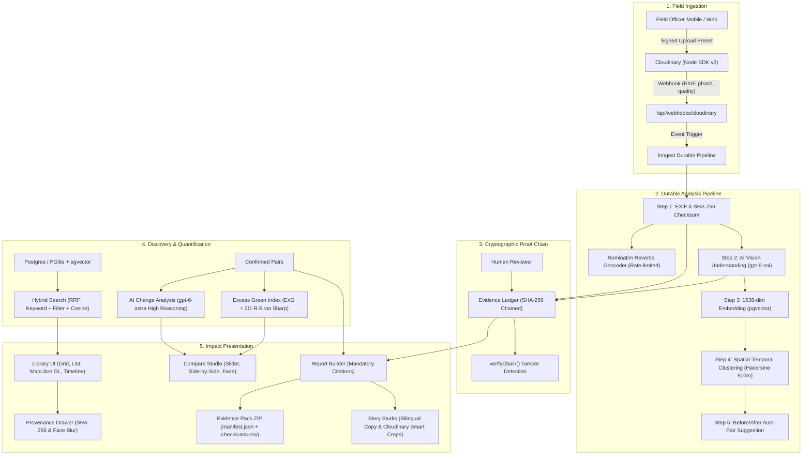

# ImpactLens — Media Intelligence for Impact

> **A media-intelligence platform on Cloudinary for NGOs, governments, and sustainability teams.**  
> Upload field photos and videos; auto-organize by project, location, and timeline; discover with hybrid semantic search; quantify ground changes with computer vision before/after comparisons; and generate tamper-evident reports with cryptographic provenance.

---

## 🌟 Key Differentiators & Highlights

1. **Original Evidence is IMMUTABLE**: Original field media uploaded to Cloudinary is never overwritten or deleted. All enhancements (face blurring, smart crops, overlays) are strictly generated as derivatives and clearly labeled.
2. **Cryptographic Proof Chain**: Every upload, AI vision analysis, reviewer audit, and report citation is recorded in a SHA-256 hash-chained ledger (`entry_hash = SHA-256(prev_hash + canonical_json)`). Chain tampering is detected instantly.
3. **Responsible AI Design**:
   - **Observation vs Interpretation Separation**: AI outputs state strictly what the pixels show before offering contextual interpretation.
   - **Mandatory Limitations**: Camera angle deviations, solar azimuth differences, and seasonal variations are explicitly disclosed.
   - **Privacy Protections**: One-click face blurring (`e_blur_faces:1000`) and GPS coordinate coarsening for sensitive ecological sites.
4. **Computer Vision Quantification**: Excess Green Index (`ExG = 2*G - R - B`) computed server-side via `sharp` on aligned images to quantify canopy expansion transparently.
5. **Mandatory Evidence Citations**: Report claims cannot exist without citing ≥1 verifiable Cloudinary evidence asset ID. Schema strictly rejects ungrounded claims.
6. **Zero-Config Hybrid Database**: Runs on PostgreSQL with `pgvector` or falls back seamlessly to embedded persistent `PGlite` with `pgvector` for instant local execution without Docker.

---

## 🏗️ Architecture



---

## ⚡ Quick Start

### 1. Prerequisites
- Node.js 18+ (tested on Node.js 20 & 22)
- npm or pnpm

### 2. Setup Environment
```bash
cp .env.example .env.local
```
*(If `OPENAI_API_KEY` or `CLOUDINARY_*` keys are omitted, ImpactLens automatically runs in **DEMO MODE** with pre-recorded realistic fixtures).*

### 3. Initialize & Seed Database
```bash
npm install
npm run db:seed
```
This populates 64 realistic field evidence assets across 3 Indian projects (Western Ghats Afforestation, Bellandur Lake Cleanup, Barmer Solar Drinking Water), 6 confirmed before/after pairs with Excess Green Index metrics, and an intact SHA-256 cryptographic ledger chain.

### 4. Start Development Server
```bash
npm run dev
```
Open **[http://localhost:3000](http://localhost:3000)** in your browser.

### 5. Run Verification & Unit Tests
```bash
npm run test
npm run typecheck
npx playwright test
```

---

## 🎬 2-Minute Live Demo Script (For Judges)

1. **Dashboard Overview (0:00 - 0:25)**:
   - Navigate to `/dashboard`. Highlight the KPI cards: 68 Assets, 94.1% Verified Ground Truth, +38.4% Mean Green Cover growth.
   - Point out the active geographic clusters rendered with MapLibre GL JS (Satara, Bellandur, Barmer).
   - Point out the Responsible AI indicators (Face blur toggle, GPS coarsening, AI derivative badges).

2. **Evidence Library & Provenance Drawer (0:25 - 0:50)**:
   - Navigate to `/dashboard/library`.
   - Switch between **Grid**, **List**, **Map**, and **Timeline** views.
   - Click on any asset card to open the **Provenance Drawer**.
   - Show the immutable original SHA-256 checksum, raw EXIF telemetry (GPS coordinates, capture date, camera lens).
   - Toggle **Face Blur** to see the live Cloudinary derivative transformation (`e_blur_faces:1000`) for privacy protection.
   - Show the separation between **Factual Observations** (what pixels show) and **AI Interpretation**.

3. **Semantic Discovery (0:50 - 1:15)**:
   - Navigate to `/dashboard/search`.
   - Click on the suggestion chip: *"lake cleanup volunteers with plastic waste"*.
   - Point out the **Reciprocal Rank Fusion** match reasons (`✓ semantic similarity`, `✓ keyword match`) and facet breakdowns.

4. **Before/After Engine & Computer Vision (1:15 - 1:35)**:
   - Navigate to `/dashboard/compare`.
   - Switch between **Interactive Slider**, **Side-by-Side**, and **Fade Blend**.
   - Show the quantified **Excess Green Index (ExG)** calculation: `+38.4 percentage points` canopy increase.
   - Highlight the **Transparent Limitations & Disclosures** section (azimuth rotation, solar elevation, seasonal variation).

5. **Ledger Tamper Simulation & Audited Report (1:35 - 2:00)**:
   - Navigate to `/dashboard/verify`.
   - Observe the **"Chain Intact"** status badge verifying all hash-chained blocks.
   - Click **"Simulate Tamper"**: watch the system immediately catch the modified payload and flag the exact broken block. Click **"Restore Intact Chain"**.
   - Navigate to `/dashboard/reports`. Point out how every claim has a clickable citation `[Evidence #demo-1]`.
   - Click **"Download Evidence Pack (.zip)"** to show the cryptographic `manifest.json`, `checksums.csv`, and markdown report packaged with JSZip.

---

## 🔒 Responsible AI & Critical Integrity Rules

| Rule | Enforcement Mechanism |
|---|---|
| **No Fabrication** | Real data or clearly labeled DEMO MODE fixtures. |
| **Evidence Immutability** | Originals in Cloudinary are write-protected; generative edits apply only to derivatives. |
| **Mandatory Citations** | Zod `ReportClaimSchema` enforces `min(1)` evidence asset ID per claim. |
| **Observation vs Interpretation** | Separated in prompt and validated into distinct schema arrays. |
| **Tamper Detection** | SHA-256 hash chaining: `entry_hash = SHA-256(prev_hash + canonical_json)`. |

---

## 📜 License
MIT License. Openly licensed demo imagery sourced under CC-BY-SA and Unsplash Free License with full attribution in `scripts/seed.ts`.
